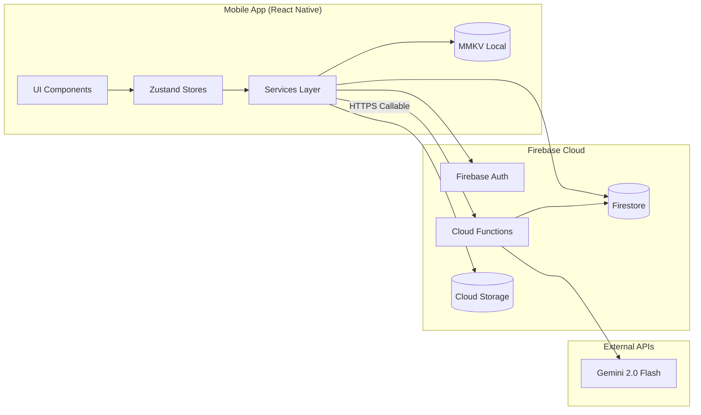

# Architecture Decision Document — SnapLog AI Vision

**Author:** Avish
**Date:** 2026-02-25

---

## Project Context Analysis

### Requirements Overview

**Functional Requirements:**

SnapLog defines 30 functional requirements (FR1–FR30) organized into 7 capability areas:

| Category | FRs | Architectural Implication |
|---|---|---|
| Camera & Image Capture | FR1–FR5 | Native device API integration via Expo modules; client-side image compression pipeline |
| AI Analysis | FR6–FR10 | Backend orchestration layer (Cloud Function); schema validation boundary (Zod); graceful degradation path |
| Item Review & Editing | FR11–FR15 | Pre-populated form binding; inline editing; state management for draft items |
| Item Storage | FR16–FR20 | Dual-write architecture (local + cloud); background sync queue; conflict resolution |
| Dashboard & Discovery | FR21–FR25 | Efficient list rendering (FlatList virtualization); client-side search/filter; pagination strategy |
| Export | FR26–FR27 | File system access; native share sheet integration |
| API & Rate Limiting | FR28–FR30 | Server-side rate limiting; structured logging; server-side prompt configuration |

**Non-Functional Requirements:**

| NFR Category | Key Constraints | Architectural Impact |
|---|---|---|
| Performance | Image compression <2s; AI round-trip <4s (p95); 60fps scroll at 500 items; <3s warm start | Compression pipeline optimization; Cloud Function cold start management; FlatList with virtualization |
| Security | No client-side AI credentials; user data isolation; authenticated sessions | Firebase Security Rules; Cloud Function–only AI access; Firebase Auth scoping |
| Reliability | 0% crash rate on AI/network failures; 2× retry with backoff; drafts survive force-quit | Defensive error boundaries; MMKV persistence; background sync with retry |
| Scalability | Elastic cloud infrastructure; 20 req/user/hour rate limit | Firebase auto-scaling; Cloud Function rate limiter |
| Compatibility | iOS 15+, Android 10+ (API 29); no native ejection; rear camera only | Expo Managed Workflow; cross-platform feature parity testing |

**Scale & Complexity:**

- Primary domain: Mobile Application (React Native / Expo)
- Complexity level: Medium
- Estimated architectural components: 12 (see Project Structure)
- Cross-cutting concerns: 4 (offline sync, error handling, authentication, AI integration)

### Technical Constraints & Dependencies

| Constraint | Source | Impact |
|---|---|---|
| Expo Managed Workflow | PRD requirement | Cannot use native modules that require ejection |
| Firebase-only backend | PRD tech stack | All backend logic in Cloud Functions; no custom server |
| Gemini 2.0 Flash | PRD AI choice | Multimodal input via image URL; strict JSON output required |
| Single developer | Project context | Architecture must be simple enough for solo maintenance |
| Portfolio project | PRD scope | Optimized for demonstration quality, not enterprise scale |

### Cross-Cutting Concerns Identified

1. **Offline-First Data Flow** — Every write operation must work without network; sync engine touches Camera, Storage, Dashboard, and AI modules.
2. **Error Handling & Graceful Degradation** — AI failures, network timeouts, and permission denials all require consistent, non-crashing recovery paths across every screen.
3. **Authentication Scoping** — Firebase Auth (anonymous + Google) scopes all Firestore reads/writes and Cloud Storage access via Security Rules.
4. **Loading & Feedback States** — Consistent loading, success, and error state patterns across AI analysis, data sync, and list rendering.

---

## Starter Template Evaluation

### Primary Technology Domain

Mobile Application (React Native / Expo) — identified from PRD classification and tech stack.

### Starter Options Considered

| Starter | Version | Pros | Cons |
|---|---|---|---|
| `create-expo-app` (Expo CLI) | Expo SDK 54 | Official Expo starter; TypeScript template; managed workflow; aligns with PRD | Does not include Firebase, navigation, or state management out of the box |
| Ignite (Infinite Red) | Latest | Full boilerplate with navigation, state management, testing | Opinionated; uses MobX-State-Tree instead of Zustand; heavy for portfolio project |
| Custom manual setup | — | Full control; exactly what's needed | More initial effort; no community template to reference |

### Selected Starter: `create-expo-app` (Expo SDK 54)

**Rationale for Selection:**

- Official Expo starter guarantees compatibility with Expo SDK 54 and React Native 0.81
- TypeScript template provides type safety from day one
- Minimal opinions — allows us to add exactly the libraries specified in the PRD (React Native Paper, Zustand, React Navigation)
- Managed Workflow by default — no ejection required
- Well-documented; easiest onboarding path for a solo developer

**Initialization Command:**

```bash
npx -y create-expo-app@latest ./ --template tabs
```

> **Note:** The `tabs` template provides a basic tab navigation scaffold using Expo Router, which aligns with the Dashboard | Settings tab structure in the PRD. After initialization, we will replace the default navigation with React Navigation 7.x as specified in the PRD (strictly adhering to project rules; Expo Router is not permitted).

**Architectural Decisions Provided by Starter:**

**Language & Runtime:**
- TypeScript 5.x with strict mode
- React 19, React Native 0.81 (via Expo SDK 54)

**Build Tooling:**
- Metro bundler (via Expo)
- EAS Build for production builds

**Development Experience:**
- Expo Dev Client for development
- Hot reloading via Metro
- Expo Go for quick preview (iOS demo path)

**Note:** Project initialization using this command should be the first implementation story.

---

## Core Architectural Decisions

### Decision Priority Analysis

**Critical Decisions (Block Implementation):**
- Navigation framework
- State management library
- Data persistence strategy (local + cloud)
- AI integration architecture
- Authentication strategy

**Important Decisions (Shape Architecture):**
- Image compression pipeline
- Error handling strategy
- Offline sync architecture
- API response format

**Deferred Decisions (Post-MVP):**
- Analytics integration
- Push notification strategy
- Batch scanning architecture
- Multi-user workspace data model

### Data Architecture

| Decision | Choice | Version | Rationale |
|---|---|---|---|
| Cloud Database | Firebase Firestore | v12.9.0 (JS SDK) | PRD requirement; real-time sync; auto-scaling; generous free tier |
| Local Storage | MMKV | Latest via `react-native-mmkv` | ~30x faster than AsyncStorage; synchronous reads; supports offline draft queue |
| File Storage | Firebase Cloud Storage | v12.9.0 (JS SDK) | PRD requirement; integrates with Security Rules; CDN-backed |
| Schema Validation | Zod | v4.3.x | PRD requirement; validates AI JSON output; TypeScript-first; small bundle |
| Data Modeling | User-scoped Subcollections | — | Items stored at `users/{userId}/items`; simplifies security rules and data isolation |

**Firestore Data Model:**

```typescript
// Collection: users/{userId}/items/{itemId}
interface ItemDocument {
  id: string;
  title: string;
  category: string;
  color: string;
  condition: 'Excellent' | 'Good' | 'Fair' | 'Poor';
  tags: string[];
  notes: string;
  imageUrl: string;          // Cloud Storage download URL
  imagePath: string;         // Cloud Storage path for deletion
  aiGenerated: boolean;      // Whether fields were AI-populated
  syncStatus: 'synced' | 'pending' | 'error';
  createdAt: Timestamp;
  updatedAt: Timestamp;
}
```

**Local Draft Schema (MMKV):**

```typescript
interface LocalDraft {
  localId: string;           // UUID generated client-side
  item: Partial<ItemDocument>;
  localImageUri: string;     // Local file path before upload
  syncStatus: 'pending' | 'error';
  retryCount: number;
  createdAt: string;         // ISO string
}
```

### Authentication & Security

| Decision | Choice | Rationale |
|---|---|---|
| Auth Provider | Firebase Auth (Anonymous + Google Sign-In) | PRD requirement; anonymous auth for zero-friction start; Google for persistent identity |
| Authorization | Firestore Security Rules | User-scoped reads/writes; no admin SDK needed client-side |
| API Security | Cloud Function–only AI access | Gemini API key stored in Firebase environment config; never exposed to client |
| Data Isolation | User-scoped Firestore paths | `users/{userId}/items/*` — each user can only access own data (NFR-S2) |

**Firestore Security Rules Pattern:**

```javascript
rules_version = '2';
service cloud.firestore {
  match /databases/{database}/documents {
    match /users/{userId}/items/{itemId} {
      allow read, write: if request.auth != null && request.auth.uid == userId;
    }
  }
}
```

**Cloud Storage Security Rules Pattern:**

```javascript
rules_version = '2';
service firebase.storage {
  match /b/{bucket}/o {
    match /users/{userId}/items/{imageId} {
      allow read, write: if request.auth != null && request.auth.uid == userId;
      allow read: if request.auth != null && request.auth.uid == userId;
    }
  }
}
```

### API & Communication Patterns

| Decision | Choice | Rationale |
|---|---|---|
| Client ↔ Backend | Firebase Cloud Functions (HTTPS Callable) | Type-safe callable functions; automatic auth token forwarding; no REST endpoint management |
| AI Orchestration | Cloud Function → Gemini 2.0 Flash | Server-side prompt; server-side response parsing; client never touches AI API |
| Rate Limiting | In-memory counter per user in Cloud Function | 20 req/user/hour; simple implementation; sufficient for portfolio scale |
| Error Format | Structured `{ success, data, error }` wrapper | Consistent client-side parsing; clear success/failure distinction |

**Cloud Function API Contract:**

```typescript
// Callable function: analyzeItem
// Input
interface AnalyzeItemRequest {
  imageUrl: string;  // Cloud Storage download URL
}

// Output
interface AnalyzeItemResponse {
  success: boolean;
  data?: {
    title: string;
    category: string;
    color: string;
    condition: string;
  };
  error?: {
    code: 'RATE_LIMITED' | 'AI_PARSE_FAILURE' | 'AI_TIMEOUT' | 'INVALID_IMAGE';
    message: string;
  };
}
```

**Gemini Prompt Strategy:**

```
Prompt stored server-side in Cloud Function source code (FR30 — configurable without app update).
Prompt template instructs Gemini to return ONLY raw JSON (no markdown fences).
Cloud Function strips any accidental code fences before Zod parsing.
```

### Frontend Architecture

| Decision | Choice | Version | Rationale |
|---|---|---|---|
| Navigation | React Navigation | v7.x | PRD requirement; stable; supports Stack + Tab + Modal patterns required by UX spec |
| State Management | Zustand | v5.x | PRD requirement; minimal boilerplate; ~2KB bundle; hooks-based; built-in persist middleware for MMKV |
| UI Component Library | React Native Paper | v5.15.x | PRD requirement; Material Design 3; accessible by default; extensive theming |
| Styling | StyleSheet.create + Theme tokens | — | UX spec mandates central theme.ts; no utility-class approach needed |
| Image Handling | expo-image-manipulator | Latest (Expo SDK 54) | PRD requirement; resize + compress before upload |
| Camera | expo-camera | Latest (Expo SDK 54) | PRD requirement; managed workflow compatible |
| Font Loading | expo-font (Inter) | Latest (Expo SDK 54) | UX spec mandates Inter as primary typeface |

**State Architecture (Zustand):**

```typescript
// stores/useItemStore.ts — Item list + sync state
interface ItemStore {
  items: ItemDocument[];
  drafts: LocalDraft[];
  isLoading: boolean;
  searchQuery: string;
  categoryFilter: string | null;

  // Actions
  addItem: (item: ItemDocument) => void;
  addDraft: (draft: LocalDraft) => void;
  syncDraft: (localId: string) => Promise<void>;
  setSearchQuery: (query: string) => void;
  setCategoryFilter: (category: string | null) => void;
}

// stores/useAuthStore.ts — Auth state
interface AuthStore {
  user: User | null;
  isAuthenticated: boolean;
  signInAnonymously: () => Promise<void>;
  signInWithGoogle: () => Promise<void>;
  signOut: () => Promise<void>;
}

// stores/useNetworkStore.ts — Network status
interface NetworkStore {
  isOnline: boolean;
  setOnline: (status: boolean) => void;
}
```

### Infrastructure & Deployment

| Decision | Choice | Rationale |
|---|---|---|
| Backend Hosting | Firebase Cloud Functions (Node.js 20) | PRD requirement; auto-scaling; pay-per-use |
| CI/CD | GitHub Actions | PRD requirement; lint + type check on PR |
| Mobile Distribution (Android) | Side-loaded APK via EAS Build | PRD requirement; no Play Store for MVP |
| Mobile Distribution (iOS) | Expo Go (demo) | PRD requirement; no App Store for MVP |
| Environment Config | Firebase environment config (`GEMINI_API_KEY`) | Secure; no secrets in client bundle |
| Monitoring | Firebase Crashlytics + Cloud Function logs | PRD requirement; crash rate tracking; AI parse failure logging |

### Decision Impact Analysis

**Implementation Sequence:**
1. Expo project initialization with `create-expo-app`
2. React Navigation setup (Tab + Stack + Modal)
3. Firebase integration (Auth, Firestore, Cloud Storage)
4. Zustand stores (items, auth, network)
5. Camera + image compression pipeline
6. Cloud Function + Gemini AI integration
7. UI screens (Dashboard, Camera, Review Form, Settings)
8. Offline sync engine
9. CSV export
10. CI/CD pipeline (GitHub Actions)

**Cross-Component Dependencies:**
- Camera → Image Compression → Cloud Storage → Cloud Function → Gemini → Zod → Review Form
- Zustand Item Store ↔ MMKV (persistence) ↔ Firestore (sync)
- Firebase Auth → Security Rules → Firestore + Cloud Storage access
- Network Store → Sync Engine → Draft Queue

---

## Implementation Patterns & Consistency Rules

### Pattern Categories Defined

**Critical Conflict Points Identified:** 18 areas where AI agents could make different choices

### Naming Patterns

**Firestore Naming Conventions:**

| Element | Convention | Example |
|---|---|---|
| Collection names | camelCase, plural | `items`, `users` |
| Document fields | camelCase | `syncStatus`, `createdAt`, `imageUrl` |
| Subcollection paths | `users/{userId}/items/{itemId}` | Scoped per user |

**Code Naming Conventions:**

| Element | Convention | Example |
|---|---|---|
| Files — Components | PascalCase `.tsx` | `ItemCard.tsx`, `ScanLoadingOverlay.tsx` |
| Files — Hooks | camelCase with `use` prefix `.ts` | `useItemStore.ts`, `useNetworkStatus.ts` |
| Files — Utilities | camelCase `.ts` | `imageCompressor.ts`, `csvExporter.ts` |
| Files — Types | camelCase `.ts` | `item.types.ts`, `api.types.ts` |
| Files — Constants | camelCase `.ts` | `theme.ts`, `config.ts` |
| Components | PascalCase | `ItemCard`, `SyncStatusBar` |
| Functions | camelCase | `compressImage`, `analyzeItem` |
| Variables | camelCase | `syncStatus`, `isLoading` |
| Constants | SCREAMING_SNAKE_CASE | `MAX_IMAGE_SIZE`, `AI_TIMEOUT_MS` |
| Zustand stores | `use` + Entity + `Store` | `useItemStore`, `useAuthStore` |
| Types/Interfaces | PascalCase | `ItemDocument`, `LocalDraft` |
| Enums | PascalCase | `SyncStatus.Pending` |

**Cloud Function Naming:**

| Element | Convention | Example |
|---|---|---|
| Function name | camelCase | `analyzeItem`, `syncItem` |
| Environment vars | SCREAMING_SNAKE_CASE | `GEMINI_API_KEY` |

### Structure Patterns

**Project Organization:** Feature-first with shared modules

```
src/
├── components/      # Reusable UI components (not feature-specific)
├── screens/         # Screen-level components (one per route)
├── navigation/      # Navigation configuration
├── stores/          # Zustand stores
├── services/        # Business logic + external API calls
├── hooks/           # Custom React hooks
├── utils/           # Pure utility functions
├── types/           # TypeScript type definitions
├── constants/       # App constants + theme
└── assets/          # Static assets (images, fonts)
```

**Test Location:** Co-located `__tests__` directories

```
src/
├── components/
│   ├── ItemCard.tsx
│   └── __tests__/
│       └── ItemCard.test.tsx
├── services/
│   ├── aiService.ts
│   └── __tests__/
│       └── aiService.test.ts
```

### Format Patterns

**API Response Format (Cloud Functions):**

```typescript
// SUCCESS
{ success: true, data: { title: "...", category: "...", color: "...", condition: "..." } }

// ERROR
{ success: false, error: { code: "AI_PARSE_FAILURE", message: "..." } }
```

**Date Format:** ISO 8601 strings in transit; Firestore `Timestamp` in database.

**JSON Field Naming:** camelCase everywhere (client, API, Firestore).

**Boolean Representations:** `true`/`false` only; never `1`/`0`.

**Null Handling:** Use `null` for absent values; never `undefined` in persisted data.

### Communication Patterns

**State Management Patterns (Zustand):**

- Immutable updates using spread operator
- Actions co-located in store definition (not separate action files)
- Selectors use shallow comparison for performance: `useItemStore(state => state.items, shallow)`
- Persist middleware for MMKV: `persist(storeDefinition, { name: 'item-store', storage: mmkvStorage })`

**Event/Lifecycle Patterns:**

- Network status changes detected via `@react-native-community/netinfo`
- Sync engine triggers on: (a) network restored, (b) app foregrounded, (c) new draft saved while online
- No custom event bus — all communication via Zustand store subscriptions

### Process Patterns

**Error Handling:**

| Layer | Approach | Example |
|---|---|---|
| UI Components | React Error Boundary at screen level | Catches render errors; shows friendly fallback |
| API Calls | try/catch with typed error responses | `catch (e) { if (e.code === 'RATE_LIMITED') ... }` |
| AI Analysis | Zod `.safeParse()` with fallback to manual entry | Never throws on bad AI output |
| Network | NetInfo listener + offline banner | User always knows online/offline state |
| Cloud Function | Structured logging with `functions.logger` | Actionable error logs with raw AI response |

**Error Message Tone:** Written by a calm, helpful friend (UX spec requirement). Example: *"Couldn't analyze image. Fill in details manually or retry."*

**Loading State Patterns:**

| Context | State Variable | UI Pattern |
|---|---|---|
| AI Analysis | `isAnalyzing: boolean` | `ScanLoadingOverlay` (custom, not bare spinner) |
| Dashboard load | `isLoading: boolean` | Skeleton item cards (3× shimmer) |
| Image upload | `uploadProgress: number` | Linear progress bar replacing Confirm button |
| Background sync | `pendingSyncCount: number` | `SyncStatusBar` (persistent, non-blocking) |

**Retry Pattern:**

```typescript
// Max 2 retries, exponential backoff (1s, 2s)
const MAX_RETRIES = 2;
const BASE_DELAY_MS = 1000;

async function withRetry<T>(fn: () => Promise<T>): Promise<T> {
  for (let attempt = 0; attempt <= MAX_RETRIES; attempt++) {
    try {
      return await fn();
    } catch (error) {
      if (attempt === MAX_RETRIES) throw error;
      await delay(BASE_DELAY_MS * Math.pow(2, attempt));
    }
  }
  throw new Error('Unreachable');
}
```

### Enforcement Guidelines

**All AI Agents MUST:**

1. Use the naming conventions defined above — no exceptions for "temporary" code
2. Place all files in the directories specified in the Project Structure section
3. Use Zustand for all global state — no React Context for data state (Context is acceptable for theme/navigation providers only)
4. Use `StyleSheet.create` with theme tokens from `constants/theme.ts` — never hardcode colors, spacing, or font sizes
5. Handle all errors with try/catch and user-friendly messages — no unhandled promise rejections
6. Include `testID` props on all interactive elements for testing
7. Include `accessibilityLabel` on all interactive and semantically meaningful elements

**Pattern Examples:**

✅ **Good:**
```typescript
import { useItemStore } from '@/stores/useItemStore';
import { theme } from '@/constants/theme';

const styles = StyleSheet.create({
  card: {
    backgroundColor: theme.colors.surface,
    borderRadius: 12,
    padding: theme.spacing.space4,
  },
});
```

❌ **Anti-Pattern:**
```typescript
// BAD: Hardcoded colors
const styles = StyleSheet.create({
  card: { backgroundColor: '#1A1A22', borderRadius: 12, padding: 16 },
});

// BAD: useState for global state
const [items, setItems] = useState<Item[]>([]);

// BAD: Unhandled error
const result = await analyzeItem(imageUrl); // No try/catch
```

---

## Project Structure & Boundaries

### Complete Project Directory Structure

```
snaplog-ai-vision/
├── README.md
├── package.json
├── tsconfig.json
├── app.json                          # Expo configuration
├── babel.config.js
├── metro.config.js
├── eas.json                          # EAS Build configuration
├── .env.example                      # Environment variable template
├── .gitignore
├── .eslintrc.js
├── .prettierrc
├── .github/
│   └── workflows/
│       └── ci.yml                    # GitHub Actions: lint + type check
│
├── assets/
│   ├── fonts/
│   │   └── Inter/                    # Inter font files
│   ├── images/
│   │   ├── icon.png
│   │   ├── splash.png
│   │   └── empty-state.svg           # Dashboard empty state illustration
│   └── adaptive-icon.png
│
├── functions/                        # Firebase Cloud Functions (separate Node.js project)
│   ├── package.json
│   ├── tsconfig.json
│   ├── .eslintrc.js
│   ├── src/
│   │   ├── index.ts                  # Cloud Function exports
│   │   ├── analyzeItem.ts            # Gemini AI analysis function
│   │   ├── prompts/
│   │   │   └── itemAnalysis.ts       # Gemini prompt template (FR30)
│   │   ├── validators/
│   │   │   └── itemSchema.ts         # Zod schema for AI response validation
│   │   ├── middleware/
│   │   │   └── rateLimiter.ts        # Rate limiting logic (FR28)
│   │   └── utils/
│   │       ├── geminiClient.ts       # Gemini API client wrapper
│   │       ├── responseParser.ts     # Strip markdown fences + parse JSON
│   │       └── logger.ts             # Structured logging helper
│   └── __tests__/
│       ├── analyzeItem.test.ts
│       ├── rateLimiter.test.ts
│       └── responseParser.test.ts
│
├── firestore.rules                   # Firestore Security Rules
├── storage.rules                     # Cloud Storage Security Rules
├── firebase.json                     # Firebase project configuration
├── .firebaserc                       # Firebase project aliases
│
└── src/                              # React Native application source
    ├── App.tsx                        # App root with providers (Paper, Navigation, Auth)
    │
    ├── constants/
    │   ├── theme.ts                  # MD3 dark theme tokens (colors, typography, spacing)
    │   ├── config.ts                 # App constants (MAX_IMAGE_SIZE, AI_TIMEOUT_MS, etc.)
    │   └── categories.ts            # Item category definitions
    │
    ├── types/
    │   ├── item.types.ts            # ItemDocument, LocalDraft interfaces
    │   ├── api.types.ts             # AnalyzeItemRequest/Response types
    │   └── navigation.types.ts      # Navigation param list types
    │
    ├── navigation/
    │   ├── RootNavigator.tsx         # Tab Navigator (Dashboard | Settings)
    │   ├── DashboardStack.tsx        # Stack: ItemList → ItemDetail → EditItem
    │   └── linking.ts               # Deep linking configuration
    │
    ├── screens/
    │   ├── DashboardScreen.tsx       # Item list + search + filter + FAB
    │   ├── ItemDetailScreen.tsx      # Read-only item detail view
    │   ├── EditItemScreen.tsx        # Edit existing item (same form as Review)
    │   ├── CameraScreen.tsx          # Full-screen camera modal
    │   ├── ReviewFormScreen.tsx      # AI-populated / manual entry form
    │   ├── SettingsScreen.tsx        # Export CSV, app info, sign-out
    │   └── __tests__/
    │       ├── DashboardScreen.test.tsx
    │       └── ReviewFormScreen.test.tsx
    │
    ├── components/
    │   ├── ItemCard.tsx              # Dashboard item card with sync badge
    │   ├── ScanLoadingOverlay.tsx    # AI analysis loading overlay
    │   ├── AIFieldBadge.tsx          # Sparkle icon for AI-populated fields
    │   ├── SyncStatusBar.tsx         # Pending sync banner
    │   ├── EmptyStateCard.tsx        # First-run dashboard illustration
    │   ├── PermissionCard.tsx        # Camera permission explanation
    │   ├── CategoryChip.tsx         # Category filter chip
    │   └── __tests__/
    │       ├── ItemCard.test.tsx
    │       └── ScanLoadingOverlay.test.tsx
    │
    ├── stores/
    │   ├── useItemStore.ts          # Item list + drafts + search/filter state
    │   ├── useAuthStore.ts          # Auth state + actions
    │   ├── useNetworkStore.ts       # Network connectivity state
    │   └── __tests__/
    │       └── useItemStore.test.ts
    │
    ├── services/
    │   ├── firebaseConfig.ts        # Firebase app initialization
    │   ├── authService.ts           # Auth operations (anonymous, Google)
    │   ├── firestoreService.ts      # Firestore CRUD operations
    │   ├── storageService.ts        # Cloud Storage upload/download
    │   ├── aiService.ts             # Call analyzeItem Cloud Function
    │   ├── syncService.ts           # Offline draft sync engine
    │   ├── imageService.ts          # Image compression pipeline
    │   └── csvService.ts            # CSV export logic
    │
    ├── hooks/
    │   ├── useCamera.ts             # Camera permission + capture logic
    │   ├── useImagePicker.ts        # Gallery picker logic
    │   ├── useNetworkStatus.ts      # NetInfo listener hook
    │   ├── useSync.ts               # Sync trigger hook (foreground/network change)
    │   └── useDebounce.ts           # Debounced search input
    │
    └── utils/
        ├── mmkvStorage.ts           # MMKV storage adapter for Zustand persist
        ├── formatters.ts            # Date, text formatting helpers
        └── validators.ts            # Client-side input validation
```

### Architectural Boundaries

**API Boundaries:**



**Key Boundary Rules:**

1. **UI → Stores only** — Screens and components read state exclusively from Zustand stores and dispatch actions to stores. No direct service calls from UI components.
2. **Stores → Services** — Business logic lives in the services layer. Stores call services and update their own state with results.
3. **Services → Firebase** — All Firebase SDK calls are encapsulated in service files. No raw Firestore/Storage/Auth calls outside `services/`.
4. **Cloud Function → Gemini** — The mobile app **never** calls Gemini directly. All AI requests go through the `analyzeItem` Cloud Function.
5. **MMKV ↔ Zustand** — Local persistence is handled exclusively through Zustand's persist middleware with the MMKV adapter. No direct MMKV reads/writes outside `mmkvStorage.ts`.

### Requirements to Structure Mapping

| Requirement Category | Screens | Components | Services | Stores |
|---|---|---|---|---|
| Camera & Image (FR1–5) | `CameraScreen` | — | `imageService`, `storageService` | `useItemStore` |
| AI Analysis (FR6–10) | `ReviewFormScreen` | `ScanLoadingOverlay`, `AIFieldBadge` | `aiService` | `useItemStore` |
| Review & Edit (FR11–15) | `ReviewFormScreen`, `EditItemScreen` | — | `firestoreService` | `useItemStore` |
| Storage & Sync (FR16–20) | — | `SyncStatusBar` | `syncService`, `firestoreService`, `storageService` | `useItemStore`, `useNetworkStore` |
| Dashboard (FR21–25) | `DashboardScreen`, `ItemDetailScreen` | `ItemCard`, `EmptyStateCard`, `CategoryChip` | `firestoreService` | `useItemStore` |
| Export (FR26–27) | `SettingsScreen` | — | `csvService` | `useItemStore` |
| Rate Limiting (FR28–30) | — | — | `functions/rateLimiter`, `functions/analyzeItem` | — |

### Integration Points

**Data Flow — Scan to Save:**

```
Camera → imageService.compress() → storageService.upload()
  → aiService.analyze(imageUrl) → [Cloud Function → Gemini → Zod]
  → ReviewFormScreen (pre-populated)
  → firestoreService.saveItem() → useItemStore.addItem()
  → DashboardScreen (item visible)
```

**Data Flow — Offline Draft:**

```
Camera → imageService.compress() → aiService.analyze() → TIMEOUT
  → ReviewFormScreen (manual entry)
  → useItemStore.addDraft() → MMKV persist
  → [Network restored] → syncService.syncDraft()
  → storageService.upload() → firestoreService.saveItem()
  → useItemStore.removeDraft() + addItem()
```

---

## Architecture Validation Results

### Coherence Validation ✅

**Decision Compatibility:**
All technology choices are fully compatible. Expo SDK 54 bundles React Native 0.81 and React 19, which are compatible with React Navigation 7.x, React Native Paper 5.15.x, and Zustand 5.x. Firebase JS SDK 12.9.x supports modular imports for tree-shaking. Zod 4.3.x is runtime-agnostic and works in both Cloud Functions (Node.js 20) and React Native.

**Pattern Consistency:**
All naming conventions (camelCase for Firestore fields, PascalCase for components, camelCase for files except components) are internally consistent and align with React Native community conventions. API response format (`{ success, data, error }`) is used consistently in the Cloud Function and parsed consistently in `aiService.ts`.

**Structure Alignment:**
The feature-first project structure supports all architectural decisions. The separation of `services/`, `stores/`, and `screens/` enforces the boundary rules. Co-located `__tests__/` directories enable test discovery. The `functions/` directory is a standalone Node.js project with its own `package.json`, cleanly separating backend from mobile code.

### Requirements Coverage Validation ✅

**Functional Requirements Coverage:**
All 30 FRs (FR1–FR30) are mapped to specific screens, components, services, and stores. No functional requirement lacks architectural support.

**Non-Functional Requirements Coverage:**

| NFR | Architectural Support |
|---|---|
| NFR-P1 (compression <2s) | `imageService` using `expo-image-manipulator` with max 1280px resize |
| NFR-P2 (AI <4s) | Cloud Function with 6s timeout; `ScanLoadingOverlay` with progress copy |
| NFR-P3 (60fps scroll) | FlatList virtualization in `DashboardScreen`; `ItemCard` optimized with `React.memo` |
| NFR-P4 (warm start <3s) | Minimal provider wrapping; lazy loading of non-critical screens |
| NFR-S1 (no client AI keys) | Gemini API key in Firebase environment config; accessed only by Cloud Function |
| NFR-S2 (data isolation) | Firestore Security Rules scoped to `users/{userId}/*` |
| NFR-S3 (auth required) | Firebase Auth check in Cloud Function; Security Rules enforce auth.uid |
| NFR-R1 (0% crash on failures) | Error boundaries; Zod `.safeParse()`; try/catch in all async operations |
| NFR-R2 (2× retry) | `withRetry` utility in services; exponential backoff |
| NFR-R3 (drafts persist) | MMKV persistence via Zustand persist middleware; survives force-quit |
| NFR-SC1 (elastic infra) | Firebase auto-scaling for Firestore, Storage, and Cloud Functions |
| NFR-SC2 (rate limit) | `rateLimiter.ts` in Cloud Functions; 20 req/user/hour |
| NFR-C1 (no ejection) | Expo Managed Workflow; all libraries are managed-compatible |
| NFR-C2 (iOS 15+, Android 10+) | Expo SDK 54 supports both; tested via EAS Build |
| NFR-C3 (rear camera) | `expo-camera` configured for rear-facing camera |

### Implementation Readiness Validation ✅

**Decision Completeness:** All critical and important decisions are documented with specific versions and rationale. Every technology choice is verified against current stable releases.

**Structure Completeness:** The project tree defines every file and directory needed for MVP. File naming conventions, organization patterns, and boundary rules are comprehensive.

**Pattern Completeness:** All 18 identified conflict points are addressed with specific naming conventions, structural rules, and process patterns. Concrete code examples are provided for each pattern category.

### Gap Analysis Results

**No Critical Gaps.** All requirements are architecturally supported.

**Minor Gaps (Non-Blocking):**

| Gap | Priority | Recommendation |
|---|---|---|
| No formal E2E testing strategy | Nice-to-Have | Add Detox or Maestro E2E tests post-MVP |
| No push notification architecture | Deferred | Not needed for MVP per PRD |
| No batch scan data model | Deferred | Growth feature — design when implementing |
| No detailed analytics event schema | Nice-to-Have | Define analytics events during implementation if time permits |

### Architecture Completeness Checklist

**✅ Requirements Analysis**
- [x] Project context thoroughly analyzed
- [x] Scale and complexity assessed
- [x] Technical constraints identified
- [x] Cross-cutting concerns mapped

**✅ Architectural Decisions**
- [x] Critical decisions documented with versions
- [x] Technology stack fully specified
- [x] Integration patterns defined
- [x] Performance considerations addressed

**✅ Implementation Patterns**
- [x] Naming conventions established
- [x] Structure patterns defined
- [x] Communication patterns specified
- [x] Process patterns documented

**✅ Project Structure**
- [x] Complete directory structure defined
- [x] Component boundaries established
- [x] Integration points mapped
- [x] Requirements to structure mapping complete

### Architecture Readiness Assessment

**Overall Status:** READY FOR IMPLEMENTATION

**Confidence Level:** High — based on comprehensive validation results

**Key Strengths:**
- Clean separation between mobile app and backend (Cloud Functions)
- Offline-first architecture is a first-class design concern, not an afterthought
- AI integration is fully server-side with schema validation at the boundary
- Simple, flat data model avoids Firestore complexity pitfalls
- Every requirement maps cleanly to a specific architectural component

**Areas for Future Enhancement:**
- E2E testing framework selection and integration
- Analytics event schema definition
- Batch scanning architecture (Growth feature)
- Multi-user workspace data model (Vision feature)

### Implementation Handoff

**AI Agent Guidelines:**
- Follow all architectural decisions exactly as documented
- Use implementation patterns consistently across all components
- Respect project structure and boundaries
- Refer to this document for all architectural questions
- When in doubt about a naming convention or structural decision, check the Patterns section before making an independent choice

**First Implementation Priority:**
```bash
npx -y create-expo-app@latest ./ --template tabs
```

Then immediately install core dependencies:
```bash
npx expo install react-native-paper react-native-safe-area-context react-native-vector-icons
npm install zustand react-native-mmkv zod firebase @react-navigation/native @react-navigation/bottom-tabs @react-navigation/native-stack @react-native-community/netinfo
```
