# UX Design Specification — SnapLog AI Vision

**Author:** Avish
**Date:** 2026-02-25

---

## Executive Summary

### Project Vision

SnapLog AI Vision is a mobile-first inventory cataloging tool that replaces multi-minute manual data entry with a two-tap camera interaction. Its defining promise: *point, shoot, confirm — and your item is cataloged in under 10 seconds.* The app is built on a Vision-to-Structured-Form (V2SF) pattern — capturing an image and binding AI multimodal analysis output directly to an editable form — making it feel less like software and more like a superpower for resellers, homeowners, and logistics workers.

The UX must honor this promise at every touchpoint: speed before richness, clarity before density, resilience before perfection.

### Target Users

**Primary — Marcus, the Weekend Reseller**
- Tech-comfortable, time-pressured, mobile-native
- Uses the app in context (car, market stall, warehouse) — not at a desk
- Values speed and accuracy of AI above any other feature
- Will use the app dozens of times per session; repetitive actions must be minimal friction
- Pain point: manually typing item details is humiliatingly slow

**Secondary — Sarah, the Homeowner**
- Casual user, possibly first-time with inventory apps
- Uses the app for a one-time or infrequent documentation task (insurance inventory)
- Values simplicity and zero learning curve
- Core need: "I just want to photograph my stuff and get a spreadsheet"
- Won't read documentation; onboarding must be self-evident

**Tertiary — Avish (Dev/Admin)**
- Monitors system health via Firebase console
- Needs error logs to be actionable
- UX concern: surfaces operational clarity, not end-user features

### Key Design Challenges

1. **Speed vs. Trust** — The AI result appears in under 3 seconds. The UX must make users *feel* the speed is real, not rushed — through smart loading states, smooth transitions, and accurate AI fields that invite a glance rather than a scrutiny.
2. **Graceful Degradation** — When AI fails or network drops, the experience must not feel broken. Manual entry must be a first-class path, not a punishment mode.
3. **Repetitive Use Ergonomics** — Marcus will do 12+ scans in a row. The app must minimize finger travel between scans; the scan-to-confirm loop must feel like a rhythm, not a procedure.
4. **Zero Friction Onboarding** — Sarah cannot be confused by the first screen. The interface must be self-explanatory with zero required onboarding screens.

### Design Opportunities

1. **The Confirm Moment as Delight** — The moment the AI-populated form appears is the product's magic trick. The animation and visual language of that reveal is a key design opportunity to create delight and viral shareability.
2. **Offline as a Feature** — Rather than hiding offline mode, surface sync status as a visible trust signal. Users who see "2 items pending sync" feel in control, not abandoned.
3. **Camera as Identity** — The camera screen is the product's hero. A beautiful, purposeful camera UI (not a stock permission dialog) establishes the product's quality immediately.

---

## Core User Experience

### Defining Experience

SnapLog's defining experience is: **"Photograph → Watch the form fill itself → Tap Confirm."**

This mirrors Spotify's defining moment ("search for a song → tap → it plays") in its simplicity of cause and effect. The experience must feel like the AI is doing all the work, and the user is simply fact-checking. The form populating with fields is the dopamine hit; this is the interaction we must nail.

### Platform Strategy

- **Platform:** iOS + Android cross-platform mobile, via React Native (Expo Managed Workflow)
- **Input modality:** Touch-first. No keyboard-heavy flows. The camera and single-tap confirm are the primary interactions.
- **Device Capabilities to leverage:**
  - Native camera (rear-facing, single capture)
  - Native share sheet (for CSV export)
  - Haptic feedback on Confirm action
  - Network state detection for offline mode
- **Offline Capability:** Required. The full capture → manual entry → local save flow must work without any network.

### Effortless Interactions

- **Opening the camera** must be a single tap from any screen (floating action button always visible on Dashboard).
- **Confirming an item** must be one tap from the pre-populated form — the button must be the obvious, large, primary action.
- **Searching items** must begin immediately upon typing, without a "Search" button.
- **Retrying AI analysis** must be a single tap from the failure state — no navigating back.

### Critical Success Moments

1. **The AI Reveal** — The moment the pre-populated form slides in after analysis. This must feel instant and magical.
2. **The Confirm** — The moment the user taps Confirm and the item appears on the Dashboard. Must feel satisfying (haptic + animation).
3. **Permission Grant** — The moment the camera permission dialog appears. Must be preceded by a clear, friendly explanation screen that makes users feel they're in good hands.
4. **Offline Recovery** — The moment synced items flip from "Pending" to "Synced" as the network returns. Must be visible and reassuring.

### Experience Principles

1. **Speed is the feature** — Every screen exists to move the user toward Confirm faster. Any screen that doesn't serve this is suspect.
2. **AI assists, humans decide** — Pre-populated fields are suggestions, never locked. The edit path is always visible and encouraged.
3. **Failure is expected; broken is not** — Every failure state (AI timeout, no network, permission denied) has a clear, friendly recovery path.
4. **Repetition has rhythm** — The scan loop is designed like a music track: capture → reveal → confirm → return to camera. The cycle should feel natural after one repetition.
5. **Trust through transparency** — Sync status, AI confidence indicators, and clear error messages keep users informed, not anxious.

---

## Desired Emotional Response

### Primary Emotional Goals

- **Empowered and efficient** — After the first scan, users should feel like they've unlocked a superpower: "I can process my whole inventory in minutes."
- **Delighted by accuracy** — When the AI correctly identifies a Nike Jordan 1, the user should feel a genuine "Whoa" moment.
- **Calm confidence** — The overall tone should be clean and professional, not anxiety-inducing. Users should feel the app won't lose their data.

### Emotional Journey Mapping

| Stage | Target Emotion | Design Response |
|---|---|---|
| First launch | Curious, slightly uncertain | Clean, minimal first screen; camera CTA front and center |
| Camera opens | Ready, focused | Full-screen camera view with clean controls; no clutter |
| AI analysis (loading) | Anticipatory, slightly excited | Animated loading state; progress messaging that builds anticipation |
| Form populated | Delighted, validated | Smooth slide-in animation; AI fields highlighted briefly to call attention |
| Confirm tapped | Accomplished, satisfied | Haptic feedback + confirmation animation; immediate dashboard update |
| Offline mode | In control, not anxious | Clear status indicators; no crashes; "We're saving this locally" messaging |
| Sync completes | Relieved, validated | Subtle animation on item sync status flip |

### Micro-Emotions

- **Confidence over confusion** — Clear labels, predictable navigation, consistent patterns throughout
- **Trust over skepticism** — Sync indicators, error log transparency, graceful AI fallback
- **Accomplishment over frustration** — Celebrate the Confirm action visually and haptically
- **Excitement over anxiety** — The AI loading animation builds anticipation, not dread

### Design Implications

- **Delight → Rich loading animation** during AI analysis (not a generic spinner)
- **Confidence → Pre-populated field values displayed prominently** with clear fonts and whitespace
- **Trust → Sync status badge on every item card** — never ambiguous about save state
- **Speed-accomplishment → Immediate visual feedback** when item lands on dashboard post-confirm

### Emotional Design Principles

1. Celebrate the AI result — it's the magic trick; make it feel like one
2. Never leave users wondering "did it save?" — sync state is always visible
3. Error messages are written by a calm, helpful friend, not a system engineer
4. Loading states generate anticipation, not anxiety

---

## UX Pattern Analysis & Inspiration

### Inspiring Products Analysis

**1. Duolingo (Lesson → Completion Loop)**
- *What works:* The celebrate-on-success pattern is addictive. Each completed lesson feels rewarding. Applies to SnapLog's Confirm moment.
- *Transferable:* Micro-celebration (haptic + visual) on item save.

**2. Google Lens (Camera → Instant Result)**
- *What works:* Near-instant result display after camera snap. No waiting screens.
- *Transferable:* Speed is the promise; loading states must be animated and clearly progressing. Anti-pattern: showing a bare spinner with no copy.

**3. Notion (Structured Data Entry)**
- *What works:* Inline editing; fields are editable in-place, not through separate screens.
- *Transferable:* The review form should support in-place field editing. Tapping a field goes directly into edit mode.

**4. Apple's Camera App (Camera UX)**
- *What works:* Minimal chrome, full attention on the viewfinder, clear shutter button.
- *Transferable:* Camera screen must be clean, full-screen, with one obvious action (capture).

### Transferable UX Patterns

**Navigation Patterns:**
- Floating Action Button (FAB) for the primary Scan action — always visible, impossible to miss
- Tab-based bottom navigation for Dashboard / Settings

**Interaction Patterns:**
- Pull-to-refresh on Dashboard to trigger a sync check
- Swipe-to-dismiss on item cards for quick deletion (post-MVP)
- Inline editing on the Review form — tap field → keyboard opens → field editable

**Visual Patterns:**
- Card-based item list with thumbnail, title, category chip, and sync status badge
- Two-layer visual hierarchy: item image = identity signal, text fields = detail layer

### Anti-Patterns to Avoid

- **Modal confirmation dialogs for every action** — Confirm should be one tap, not two (no "Are you sure?" for normal saves)
- **Full-page error screens** — Error states should be inline (toast or inline banner), not a blocking page
- **Bottom-sheet overuse** — Reserve bottom sheets for complex choices; don't bottom-sheet every field edit
- **Hidden search** — Search must be permanently visible on the Dashboard, not behind a icon tap

### Design Inspiration Strategy

| Pattern | Action | Rationale |
|---|---|---|
| Duolingo's celebration UX | Adopt | The Confirm moment deserves a reward signal |
| Google Lens speed UX | Adopt | Loading animation with progress copy, not bare spinner |
| Apple Camera chrome-free UI | Adopt | Full-screen, minimal-chrome camera view |
| Notion inline editing | Adapt | Inline field editing for the review form on mobile |
| Swipe-to-delete on cards | Defer to post-MVP | Adds complexity; not critical for V1 |

---

## Design System Foundation

### Design System Choice

**Selected Design System: React Native Paper (Material Design 3)**

React Native Paper is already specified in the PRD tech stack and aligns perfectly with the project's requirements: it provides Material Design 3 components that are touch-optimized, accessible by default, and extensively themed.

### Rationale for Selection

- **Already in the tech stack** — no additional dependency decision required
- **Material Design 3 foundation** — provides proven mobile patterns for cards, FAB, text fields, chips, and bottom navigation — exactly the component set SnapLog needs
- **Theming support** — the MD3 theme system allows full custom color palette, ensuring the app doesn't look "generic Material"
- **Accessibility built-in** — contrast ratios, touch target sizes, and screen reader support handled at the component level
- **Community and documentation** — strong React Native community; easy to find solutions

### Implementation Approach

- Use React Native Paper's `Provider` with a custom `MD3Theme` applied at the app root
- Define all custom tokens (colors, typography, spacing, border radii) in a central `theme.ts` file
- Never use hardcoded colors or spacing values outside the theme object — always reference tokens
- Extend Paper components as needed for custom UI elements (e.g., `ItemCard`, `ScanLoadingOverlay`)

### Customization Strategy

- **Color:** A custom dark-mode-first palette that differentiates SnapLog from generic Material apps (see Visual Foundation)
- **Typography:** Replace MD3 default font with `Inter` from Google Fonts for a modern, clean feel
- **Border radius:** Increase from MD3 default (4dp) to 12dp for cards, 8dp for buttons — softer, more contemporary
- **Elevation:** Reduce shadow elevation for a flatter, more modern aesthetic; rely on color distinction instead

---

## 2. Core User Experience

### 2.1 Defining Experience

**"Photograph → Form fills → Confirm."**

This is SnapLog's defining interaction — the equivalent of Tinder's "Swipe to match." Every other screen in the app exists to support or recover from this core loop. The photography-to-form flow must be so smooth and accurate that users describe it to others without being prompted.

The specific sub-interaction that must be extraordinary: **the moment the form slides onto the screen with pre-populated AI fields.** This is not a loading spinner that resolves to a blank form. It is a reveal — fields materialize with real, specific data about the user's item. The animation and visual language of this reveal is the UX design's primary creative challenge.

### 2.2 User Mental Model

Users come to SnapLog with a mental model shaped by:
- **Google Lens:** "I point my camera at something and get information." → They expect near-instant results
- **Manual forms:** "I have to type everything." → They're delighted when they don't have to
- **E-commerce listing apps:** "I have to fill in 15 fields." → They're amazed when it's 0-1 fields

The interaction must feel like a natural evolution of what users already know from camera apps — minimal ceremony, immediate feedback — but with the structured data payoff they've never seen before.

**Where users get confused with similar apps:**
- Not knowing what to photograph (whole item? just the label?)
- Not knowing if the app is "doing something" during loading
- Not knowing if their item actually saved

### 2.3 Success Criteria

- User takes a photo → sees a populated form within 4 seconds
- User makes zero or one edit to AI fields in ≥80% of scans
- User completes the full Photograph → Confirm loop in under 10 seconds
- User's item appears on the Dashboard immediately after Confirm
- User who has never used the app can complete their first scan without any instructions

### 2.4 Novel UX Patterns

The V2SF (Vision-to-Structured-Form) pattern is novel — users don't have a strong prior mental model for it. The design must bridge familiar and new:

- **Familiar:** Camera viewfinder (universal mobile literacy)
- **Familiar:** Editable form with labeled fields
- **Novel:** Form is pre-filled with AI content that appears as if by magic

**Education strategy:** Show, don't tell. No onboarding screens. The empty state on the Dashboard includes a simple illustration and the text: "Tap the scan button to photograph any item — AI fills in the details." One sentence is sufficient.

### 2.5 Experience Mechanics

**Initiation:** User taps the FAB (camera icon) on the Dashboard. Camera opens as a full-screen modal.

**Photo Capture:**
- Full-screen camera viewfinder
- Single large shutter button (48dp, centered at bottom)
- Option to switch to Gallery picker (icon, less prominent)
- Camera permission denied → friendly explanation card with "Open Settings" CTA

**AI Analysis Loading:**
- Camera modal transitions to a loading overlay on the captured image
- Animated progress indicator (custom, not bare spinner)
- Loading copy cycle: *"Analyzing image..."* → *"Identifying item..."* → *"Almost done..."*
- Timeout at 6s: inline error state with "Fill in manually" and "Try again" CTAs

**The Reveal (Form Population):**
- Loading overlay fades out; form slides up from bottom
- AI-populated fields pulse subtly to draw attention (one-time highlight animation)
- Primary CTA: large "Confirm & Save" button
- All fields remain tappable/editable

**Completion:**
- Haptic feedback on Confirm tap
- Brief success animation (item card "flies" to top of dashboard list, metaphorically)
- Camera opens again automatically after 0.5s delay, ready for next scan (reseller mode)
- Dashboard item count increments immediately

**Error Recovery (AI Fail):**
- Toast notification: *"Couldn't analyze image. Fill in details manually or retry."*
- Same form appears, all fields blank — manual entry is identical UX, not a different screen

---

## Visual Design Foundation

### Color System

**Design direction: Dark-mode-first, with a vibrant accent that signals AI intelligence.**

SnapLog is a tool for professionals working in varied lighting conditions (warehouses, markets, car boots). Dark UI reduces eye strain and looks premium in these contexts.

**Core Palette:**

| Token | Value | Usage |
|---|---|---|
| `background` | `#0F0F13` | App background (near-black with slight blue undertone) |
| `surface` | `#1A1A22` | Card surfaces, bottom sheets, form backgrounds |
| `surfaceVariant` | `#252530` | Input field backgrounds, elevated surfaces |
| `primary` | `#7C6EF8` | Primary CTA buttons, FAB, active tab indicator |
| `primaryContainer` | `#3A2E8A` | Button pressed states, selected chips |
| `secondary` | `#64DFDF` | AI-populated field highlight, success states, sync indicators |
| `error` | `#FF6B6B` | Error states, destructive actions |
| `onBackground` | `#EAEAF0` | Primary text on dark backgrounds |
| `onSurface` | `#C8C8D4` | Secondary text on card surfaces |
| `outline` | `#3A3A48` | Dividers, input borders |

**Semantic Mapping:**
- **Sync pending:** `#F0A000` (amber) with a cloud-with-up-arrow icon
- **Sync complete:** `#4CAF50` (green) with a checkmark icon
- **AI-populated field:** Left border accent `#64DFDF` on first reveal

### Typography System

**Primary Font:** `Inter` (Google Fonts, all weights loaded via `expo-font`)

| Token | Size | Weight | Line Height | Usage |
|---|---|---|---|---|
| `displayLarge` | 28sp | 700 | 34px | Screen titles (rare) |
| `titleLarge` | 20sp | 600 | 28px | Card titles, item names |
| `titleMedium` | 16sp | 600 | 24px | Section headers, form field labels |
| `bodyLarge` | 16sp | 400 | 24px | Body text, form values |
| `bodyMedium` | 14sp | 400 | 20px | Secondary text, descriptions |
| `labelLarge` | 14sp | 600 | 20px | Button labels, chips, tabs |
| `labelSmall` | 11sp | 500 | 16px | Sync status badges, timestamps |

### Spacing & Layout Foundation

**Base unit:** 8dp (consistent with Material Design 3 and React Native Paper)

**Spacing Scale:**

| Token | Value | Usage |
|---|---|---|
| `space1` | 4dp | Icon-to-label gap, tight element spacing |
| `space2` | 8dp | Internal component padding |
| `space3` | 12dp | Component-to-component in lists |
| `space4` | 16dp | Standard screen edge margin |
| `space5` | 24dp | Section separator |
| `space6` | 32dp | Large section separator |
| `space8` | 48dp | Touch target minimum height |

**Layout Grid:**
- Mobile: 4-column grid, 16dp gutters, 16dp margins
- Content max-width: native (full-bleed within margins)

**Border Radius:**
- Cards: `12dp`
- Buttons: `8dp`
- Chips: `16dp` (pill)
- Input fields: `8dp`
- FAB: `16dp`

### Accessibility Considerations

- All text on background colors meets WCAG AA (4.5:1 minimum contrast ratio)
- Touch targets minimum 44×44dp
- All icons accompanied by visible labels or `accessibilityLabel` props
- Loading states include accessible `accessibilityLiveRegion="polite"` announcements
- Error states include `accessibilityRole="alert"` for screen readers
- Color is never the sole differentiator for state (sync status uses icon + color + text)

---

## Design Direction Decision

### Design Directions Explored

Six design directions were considered across the following dimensions:
1. **Light-mode utility-first** (familiar, low friction, high contrast)
2. **Dark-mode professional** (premium, context-appropriate for varied lighting)
3. **Dark + vibrant AI accent** (premium + communicates intelligence and novelty)
4. **Minimal white** (clean, consumer-friendly, Apple-ish)
5. **Dashboard-first layout** (item list as hero)
6. **Camera-first layout** (camera as hero, dashboard secondary)

### Chosen Direction

**Direction: Dark-mode professional with vibrant purple/teal AI accent, Camera-first.**

- Dark background (`#0F0F13`) with vibrant `#7C6EF8` primary and `#64DFDF` AI-highlight accent
- Camera is the first-class experience: the FAB is always visible, present on every screen
- Dashboard is the collection canvas, not the home base — the home base is the scan loop
- Typography is `Inter`: modern, legible, no-serif, confident

### Design Rationale

- **Dark UI:** Resellers and warehouse workers use the app in variable lighting — dark UI reduces glare and looks intentional rather than accidental
- **Purple/teal palette:** Distinctive from generic Material apps (which default to blue), signals AI and technology without being derivative of any one brand
- **Camera-first:** The camera IS the product. The FAB (scan button) must be the most prominent persistent element in the UI
- **Inter typography:** Clean, modern, highly legible at all sizes, consistent with professional tool aesthetic

### Implementation Approach

- Custom `MD3DarkTheme` applied via React Native Paper's `Provider`
- All colors defined in central `constants/theme.ts`
- The AI-highlight accent (`#64DFDF`) applied only to AI-populated fields and sync success states — keeping it semantically meaningful

---

## User Journey Flows

### Journey 1: Primary Scan Flow (Marcus — Success Path)

```mermaid
flowchart TD
    A([Dashboard]) -->|Tap FAB 📷| B[Camera Screen]
    B -->|Rear camera opens fullscreen| C{User Action}
    C -->|Tap Shutter| D[Image Captured]
    C -->|Tap Gallery Icon| E[Gallery Picker]
    E --> D
    D --> F[Loading Overlay on Image\nAnimated progress + copy]
    F -->|AI Analysis < 6s| G[Review Form\nPre-populated by AI]
    F -->|Timeout or AI Fail| H[Manual Entry Form\nAll fields blank]
    G -->|Edit any field| I[Inline Field Editor]
    I --> G
    G -->|Tap Confirm & Save| J[Haptic + Save Animation]
    H -->|Fill fields + Tap Confirm| J
    J -->|Network available| K[Firestore + Storage Save\nItem appears on Dashboard]
    J -->|No Network| L[Local Draft Save\nSyncStatus: Pending]
    K --> M([Dashboard — Item Added])
    L --> M
```

**Flow Optimization:**
- User returns to the Dashboard automatically after Confirm, seeing their item successfully added to the list (batch scanning is a Post-MVP feature)
- The Confirm button is full-width and positioned at the bottom of the form for thumb accessibility
- No confirmation dialogs on save; immediate feedback via animation

---

### Journey 2: Offline Flow (Marcus — Edge Case)

```mermaid
flowchart TD
    A([Dashboard\nOffline Banner Visible]) -->|Tap FAB| B[Camera Screen]
    B -->|Capture Photo| C[Image Captured]
    C -->|AI Call Attempted → Timeout| D[Toast: Cannot reach AI\nFill manually or retry]
    D -->|Retry| C
    D -->|Fill Manually| E[Manual Entry Form]
    E -->|Confirm| F[Draft Save Locally\nSyncStatus: Pending]
    F --> G([Dashboard\nItem shows 🟡 Pending])
    G -->|Network Restored| H[Background Sync Trigger]
    H -->|Upload Photo + Sync Firestore| I([Item shows ✅ Synced])
```

---

### Journey 3: First-Time User — Sarah (Homeowner)

```mermaid
flowchart TD
    A([First Launch]) --> B[Dashboard — Empty State\nIllustration + one-line prompt]
    B -->|Tap FAB| C{Camera Permission}
    C -->|Grant| D[Camera Screen]
    C -->|Deny| E[Permission Explanation Card\nRationale + Open Settings button]
    D -->|Capture| F[AI Analysis Loading]
    F --> G[Review Form — Pre-populated]
    G -->|No edits needed| H[Tap Confirm]
    H --> I([Dashboard — 1 Item])
    I -->|Repeat for all items| J([Full Inventory Done])
    J -->|Tap Export CSV| K[Native Share Sheet]
    K --> L([CSV sent via Email/AirDrop])
```

---

### Journey Patterns

**Navigation Patterns:**
- FAB (scan button) is the universal primary action — present on Dashboard and visible in consistent position
- Bottom Tab Navigator provides access to Dashboard and Settings — minimal tabs mean zero tab confusion
- Stack navigator within Dashboard tab handles item detail and edit flows

**Decision Patterns:**
- Binary choice points (e.g., "Camera vs. Gallery") are presented as two distinct icon buttons, never in a dropdown
- AI failure recovery always offers exactly two options: "Try again" (primary) and "Fill manually" (secondary)

**Feedback Patterns:**
- Immediate, inline feedback for all destructive or save actions
- Toast notifications for non-blocking status updates (AI failure, sync status change)
- Haptic feedback on Confirm action (primary success feedback modality)
- Sync status badge is persistent on item cards — never hidden

### Flow Optimization Principles

1. Maximum 3 taps from Dashboard to any cataloged item
2. Maximum 2 taps to initiate a new scan from any screen
3. No confirmation dialogs for saves; only for destructive actions (delete)

---

## Component Strategy

### Design System Components

The following components are available from React Native Paper (MD3) and used directly:

| Component | SnapLog Usage |
|---|---|
| `FAB` | Primary scan trigger — always visible |
| `Card` | Item list cards on Dashboard |
| `TextInput` | Review form field inputs |
| `Chip` | Category filter chips on Dashboard |
| `Snackbar` | Toast notifications (AI fail, sync updates) |
| `ActivityIndicator` | Fallback loading (small contexts) |
| `BottomNavigation` | Dashboard / Settings tab bar |
| `Searchbar` | Dashboard search input |
| `IconButton` | Gallery picker, back navigation, settings |
| `Button` (contained) | Confirm & Save CTA |
| `Button` (outlined) | Secondary actions (Try Again, Fill Manually) |

### Custom Components

#### `ItemCard`

**Purpose:** Displays a cataloged item in the Dashboard list with thumbnail, title, category chip, and sync status.

**Anatomy:**
- Left: `72×72dp` item thumbnail image (rounded corners 8dp)
- Center: Title (titleMedium), Category chip (labelSmall)
- Right: Sync status badge (icon + labelSmall)

**States:**
- `synced` — green checkmark badge
- `pending` — amber clock badge with animation pulse
- `error` — red exclamation badge with retry tap handler

**Variants:** Standard (primary), Compact (post-MVP for dense list)

**Accessibility:** `accessibilityRole="button"`, `accessibilityLabel` includes title, category, and sync status

---

#### `ScanLoadingOverlay`

**Purpose:** Full-screen overlay shown over the captured image during AI analysis.

**Anatomy:**
- Background: captured image at 60% opacity (darkened with blur)
- Center: Custom animated ring progress indicator (not RN default ActivityIndicator)
- Below indicator: Loading copy that cycles every 1.5s

**States:**
- `analyzing` — animation running + cycling copy
- `success` — brief success flash then dismisses (transitions to form)
- `timeout` — stops animation, shows inline error message with two CTAs

**Accessibility:** `accessibilityLiveRegion="polite"` on copy; role "progressbar" on indicator

---

#### `AIFieldBadge`

**Purpose:** Subtle indicator on a form field that its value was AI-populated (not user-entered).

**Anatomy:**
- Small `sparkle` icon (12dp) in teal accent color (`#64DFDF`)
- Positioned at trailing end of field label

**Behavior:**
- Visible only when field has an AI-populated value
- Hidden once user edits the field (AI badge → cleared)
- Disappears after 3 seconds on first-ever form view (educational signal only)

---

#### `SyncStatusBar`

**Purpose:** Persistent banner at top of Dashboard (below header) when there are pending-sync items.

**Anatomy:**
- Compact horizontal bar (height 32dp)
- Amber background, icon + text: "N items pending sync"
- Disappears when all items synced (animated dismiss)

**States:**
- `pending` — visible with amber styling
- `syncing` — "Syncing N items..." with progress indicator
- `complete` — brief green flash "All synced ✓" then dismisses

---

#### `EmptyStateCard`

**Purpose:** Full-width card shown on Dashboard when no items exist.

**Anatomy:**
- Illustration (custom SVG: cartoon camera with sparkles)
- Headline: "Your inventory starts here"
- Subtext: "Tap the scan button to photograph any item — AI fills in the details."
- No CTA button (the FAB is already present)

---

### Component Implementation Strategy

**Foundation:** All components built on React Native Paper primitives — no raw View/Text outside of Paper context.

**Custom component rules:**
- Every custom component lives in `components/` directory
- Props types are TypeScript interfaces defined in `components/types.ts`
- All components support `testID` prop for automated testing

### Implementation Roadmap

**Phase 1 — Core (MVP):**
1. `ScanLoadingOverlay` — critical for the core loop
2. `ItemCard` — critical for Dashboard
3. `AIFieldBadge` — communicates the V2SF magic
4. `EmptyStateCard` — first-run experience

**Phase 2 — Trust Signals:**
5. `SyncStatusBar` — offline-first trust signal
6. Refined error states on all forms

**Phase 3 — Enhancement (Post-MVP):**
7. `ItemCard` compact variant for dense lists
8. Batch scan session summary card

---

## UX Consistency Patterns

### Button Hierarchy

| Action Type | Component | Style | Example |
|---|---|---|---|
| Primary CTA | `Button` (contained) | Full-width, `primary` color, 48dp height | "Confirm & Save", "Try Again" |
| Secondary action | `Button` (outlined) | Auto-width, `outline` color | "Fill Manually" |
| Destructive action | `Button` (text, error color) | Auto-width, only in confirmation context | "Delete Item" |
| Icon-only action | `IconButton` | 44×44dp minimum touch target | Back, Gallery picker, Settings |
| Primary persistent action | `FAB` | Extended FAB with label on Dashboard | "Scan" |

**Rule:** Never display two primary (contained) buttons on the same screen. One primary, one secondary maximum.

---

### Feedback Patterns

| Situation | Pattern | Duration | Example |
|---|---|---|---|
| Save success | Haptic (medium) + animation | Immediate | Confirm tap confirmation |
| Non-blocking info | `Snackbar` (bottom) | 3 seconds | "Item saved" |
| Non-blocking warning | `Snackbar` + icon | 5 seconds | "Saved offline — will sync when connected" |
| Blocking error | Inline error card (not modal) | Persistent until resolved | AI timeout with retry/manual CTAs |
| Destructive action | `Dialog` confirmation | User-dismissed | "Delete this item?" |

**Rule:** No blocking modal dialogs for saves or confirmations. Modals only for destructive actions.

---

### Form Patterns

**Review/Edit Form Layout:**
- One field per row
- Label above input (not placeholder-only — placeholder only adds hint text, label is always visible)
- AI-populated fields show the `AIFieldBadge` icon at label trailing position
- Error state: red border + error message below field (never inside field)
- Required fields: no asterisk for MVP (all fields in the review form are optional to edit). Note: Any UI mockups explicitly labeling "Notes (optional)" should be standardized to just "Notes" for consistency.

**Keyboard Handling:**
- Form scrolls to keep focused field above keyboard
- "Return" advances to next field; last field "Return" dismisses keyboard
- "Done" button on keyboard toolbar triggers Confirm & Save

---

### Navigation Patterns

| Pattern | Usage |
|---|---|
| Bottom Tab Navigation | Primary app navigation: Dashboard / Settings |
| Stack Navigation | Within Dashboard tab: ItemList → ItemDetail → EditItem |
| Full-screen Modal | Camera capture screen — presented and dismissed as a sheet |
| Back gesture (swipe right) | Returns from Stack child to parent |

**Rule:** The camera screen is always a modal (not a tab) — it is a temporary, focused task, not a persistent destination.

---

### Empty States

| Screen | Empty State Content |
|---|---|
| Dashboard (no items) | Illustration + headline + one-line instruction |
| Search results (no match) | "No items found for '{query}'" + "Clear search" link |
| Category filter (no match) | "No items in this category" + "Clear filter" link |

**Rule:** Every empty state tells users what to do next, not just that there's nothing here.

---

### Loading States

| Context | Component | Notes |
|---|---|---|
| AI Analysis | `ScanLoadingOverlay` (custom) | Full-screen, over captured image |
| Dashboard list loading | Skeleton list items (3× `ItemCard` with shimmer) | Shown on first load |
| Image upload progress | Linear progress bar in Confirm button area | Replaces button until complete |
| Background sync | `SyncStatusBar` | Non-blocking; shown in persistent header area |

**Rule:** Never block the UI with a full-screen spinner for operations that complete in < 2 seconds. Use skeleton screens for data loading, not spinners.

---

## Responsive Design & Accessibility

### Responsive Strategy

SnapLog is designed mobile-first and mobile-primary. Cross-device strategy:

**Mobile (Primary, 320–428dp):**
- Full-bleed layouts with 16dp screen margins
- Single-column lists
- Bottom navigation
- Thumb-zone awareness: primary CTAs in bottom 40% of screen
- Minimum touch target 44×44dp

**Tablet (568–1024dp — Nice to Have, Not MVP):**
- Side-by-side layout: item list + item detail panel
- Navigation moves to side rail
- Camera modal remains full-screen

**Not Targeted:**
- Desktop web (React Native is mobile-only)

### Breakpoint Strategy

Since the app is React Native (not CSS web), breakpoints are expressed as device width thresholds:

| Breakpoint | Width | Strategy |
|---|---|---|
| Compact (phone) | < 500dp | Primary design target — all layouts optimized here |
| Medium (large phone/small tablet) | 500–800dp | Slightly wider cards; same single-column layout |
| Expanded (tablet) | > 800dp | Potential two-column layout (post-MVP) |

**Approach:** Mobile-first. Default layouts are designed for compact (< 500dp). Wider layouts are progressive enhancements.

### Accessibility Strategy

**Target Compliance: WCAG 2.2 Level AA**

SnapLog targets consumers, may be used by people with visual or motor impairments, and serves professional users in demanding environments — all justify AA compliance as the minimum.

**Key Requirements:**

| Requirement | Implementation |
|---|---|
| Color contrast ≥ 4.5:1 for text | All text colors validated against backgrounds |
| Touch targets ≥ 44×44dp | Enforced via `minHeight`/`minWidth` on all interactive elements |
| Focus indicators | React Native Paper handles this natively on Android; supplement for iOS |
| Screen reader labels | `accessibilityLabel` on all interactive and meaningful elements |
| Error announcement | `accessibilityRole="alert"` on error messages |
| Loading announcement | `accessibilityLiveRegion="polite"` on loading states |
| No color-only state | Sync status always uses icon + color + text (never color alone) |

### Testing Strategy

**Responsive Testing:**
- Test on physical iPhone SE (small) and standard Android device (360dp width)
- Test on large Android phone (414dp+)
- Use React Native's `useWindowDimensions` hook for any layout-responsive logic

**Accessibility Testing:**
- iOS: VoiceOver testing on all critical flows (scan, confirm, search)
- Android: TalkBack testing on all critical flows
- Automated: run `@testing-library/react-native` with accessibility queries in unit tests
- Manual: keyboard navigation test (external Bluetooth keyboard on iPad if post-MVP)

**Contrast Ratio Validation:**
- All color combinations validated with Stark (Figma plugin) or WebAIM Contrast Checker before implementation

### Implementation Guidelines

**Responsive Development:**
- Use `StyleSheet.create` with relative units (`%`, `flex`) over fixed pixels where possible
- Use `useWindowDimensions` hook for layout-conditional logic
- Respect `fontScale` user setting — do not hardcode font sizes that override system preference
- Image thumbnails use `resizeMode="cover"` with fixed aspect ratios for consistent cards

**Accessibility Development:**
- Every touchable component has an `accessibilityLabel` prop
- Use `accessibilityHint` for non-obvious actions
- Group related content with `accessibilityRole="group"` on container
- Ensure Tab focus order follows visual reading order
- AI-populated field badge includes `accessibilityLabel="AI-generated value"` on the icon

---

## Appendix: Screen Inventory

| Screen | Type | Route | Notes |
|---|---|---|---|
| Dashboard | Tab Screen | `DashboardScreen` | Item list, search, FAB, sync banner |
| Item Detail | Stack Screen | `ItemDetailScreen` | Read-only item detail view |
| Edit Item | Stack Screen | `EditItemScreen` | Same form as Review; used for post-save edits |
| Camera Capture | Modal | — | Full-screen camera view |
| AI Review Form | Modal continuation | — | Shown after AI analysis; pre-populated |
| Manual Entry Form | Modal continuation | — | Shown on AI failure; empty form |
| Settings | Tab Screen | `SettingsScreen` | Export CSV, app info, sign-out |
| Permission Denied | Sub-screen / state | — | Shown when camera permission denied |
| Export | Bottom Sheet | — | Triggered from Settings; opens native share |
